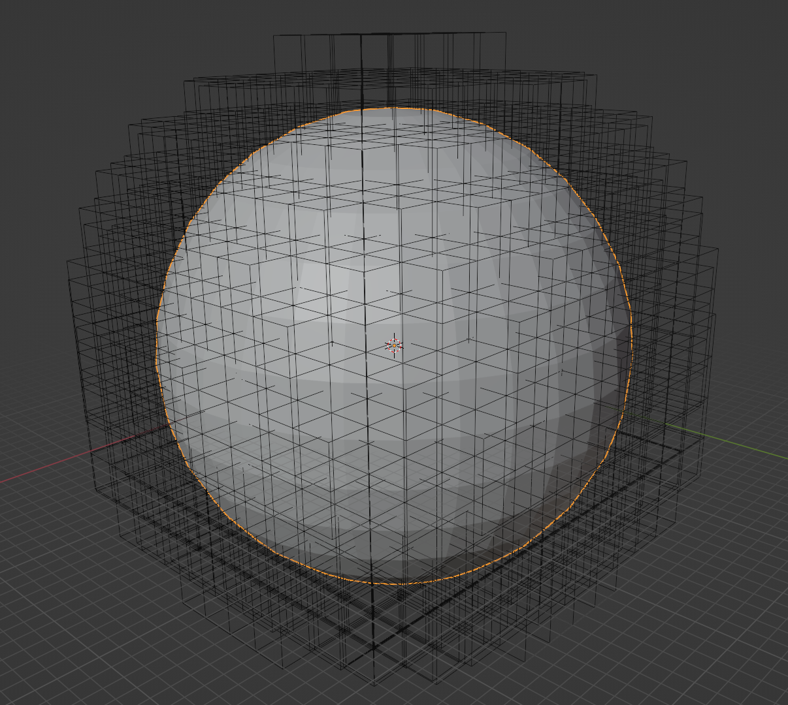

# How to build

```git clone https://github.com/AcademySoftwareFoundation/openvdb.git
cd openvdb
mkdir build
cd build
cmake .. -DUSE_NANOVDB=ON -DOPENVDB_BUILD_NANOVDB=ON -DOPENVDB_BUILD_VDB_RENDER=ON
make -j4
sudo make install
```


# Narrow band levelset of sphere



